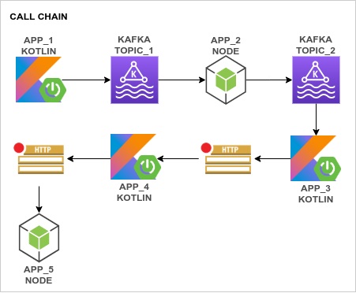
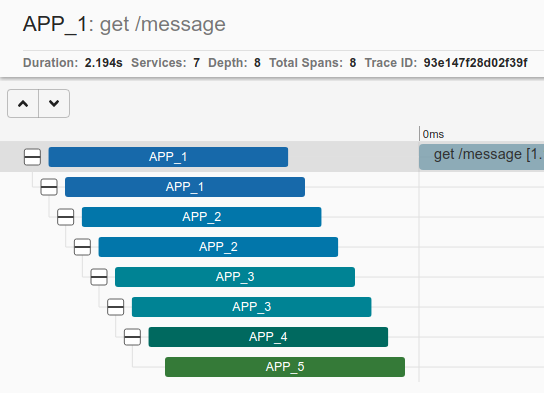
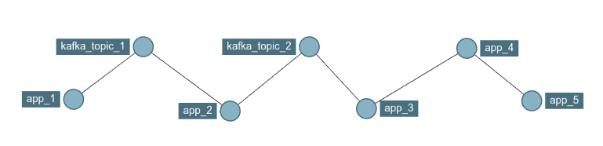

# zipkin-kotlin-node

Simple application structure to show **Zipkin** working with **NodeJS** and **SpringBoot + Kotlin**. **Spring** with **Kotlin** uses **Sleuth** and **NodeJS** uses **Zipkin JS**.

A simple message is created on the first application(**`app_1`**) and is carried to the last(**`app_5`**). The flow is expected to run in the following order:



### Dependencies

The project was tested with the following versions:

- *docker-compose*: **1.26.0**;
- *docker*: **19.03.11**;
- *java*: **14**;
- *node*: **13.14.0**;
- *maven*: **3.6.3**;
- *npm*: **6.14.4**;

### How to run

Clone the project, then run:

```
./docker-create-images.sh
docker-compose up
```

Wait for everything to start. The following ports are in use:
- **`8081`** **>** `app_1`;
- **`8082`** **>** `app_2`;
- **`8083`** **>** `app_3`;
- **`8084`** **>** `app_4`;
- **`8085`** **>** `app_5`;
- **`2181`** **>** `zookeeper`;
- **`9411`** **>** `zipkin`;
- **`9092`** **>** `kafka`;

### How to test

Follow these steps:

- Call the url in the browser: [`http://localhost:8081/message`](http://localhost:8081/message);
- Each call for the previous URL starts a new flow;
- Open **Zipkin** in the browser: [`http://localhost:9411/zipkin`](http://localhost:9411/zipkin);

It's expected that you see something like the following images when you look for **Dependencies** or **Traces** in **Zipkin**:

#### The trace:



#### The dependencies:

